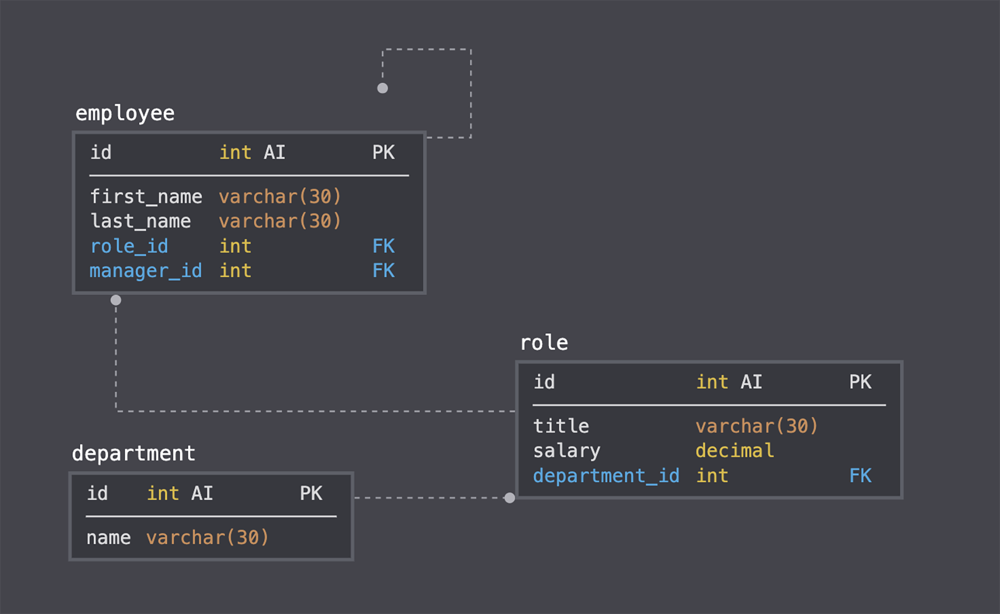

# 12. SQL Challenge: Employee Tracker
*Due Sunday by 11:59pm*

## Your Task
Developers frequently have to create interfaces that make it easy for non-developers to view and interact with information stored in databases. These interfaces are called **content management systems (CMS)**. Your challenge this week is to build a command-line application to manage a company's employee database, using Node.js, Inquirer, and MySQL.

Because this application won’t be deployed, you’ll also need to create a walkthrough video that demonstrates its functionality and all of the following acceptance criteria being met. You’ll need to submit a link to the video and add it to the README of your project.

## Getting Started
You’ll need to use the MySQL2 package to connect to your MySQL database and perform queries, the Inquirer package to interact with the user via the command-line, and the console.table package to print MySQL rows to the console.

>*You will be committing a file that contains your database credentials. Make sure your MySQL password is not used for any other personal accounts, because it will be visible on GitHub. In upcoming lessons, you will learn how to better secure this password, or you can start researching npm packages now that could help you.*

You might also want to make your queries asynchronous. MySQL2 exposes a `.promise()` function on Connections to “upgrade” an existing non-Promise connection to use Promises. Look into MySQL2's documentation to make your queries asynchronous.

Design the database schema as shown in the following image:

As the image illustrates, your schema should contain the following three tables:

* Department

    * `id`: INT PRIMARY KEY

    * `name`: VARCHAR(30) to hold department name

* Role

    * `id`: INT PRIMARY KEY

    * `title`: VARCHAR(30) to hold role title

    * `salary`:  DECIMAL to hold role salary

    * `department_id`: INT to hold reference to department role belongs to

* Employee

    * `id`: INT PRIMARY KEY

    * `first_name`: VARCHAR(30) to hold employee first name

    * `last_name`: VARCHAR(30) to hold employee last name

    * `role_id`: INT to hold reference to employee role
    
    * `manager_id`: INT to hold reference to another employee that is manager of the current employee. This field might be null if the employee has no manager

You might want to use a separate file containing functions for performing specific SQL queries you'll need to use. A constructor function or class could be helpful for organizing these. You might also want to include a `seeds.sql` file to pre-populate your database. This will make the development of individual features much easier.

## Bonus
See if you can add some additional functionality to your application, such as the ability to do the following:

* Update employee managers.

* View employees by manager.

* View employees by department.

* Delete departments, roles, and employees.

* View the total utilized budget of a department—in other words, the combined salaries of all employees in that department.